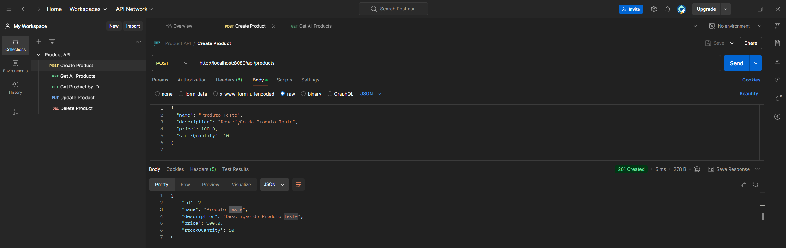
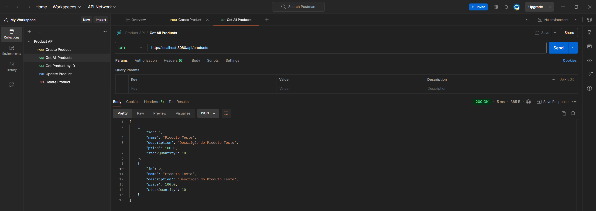
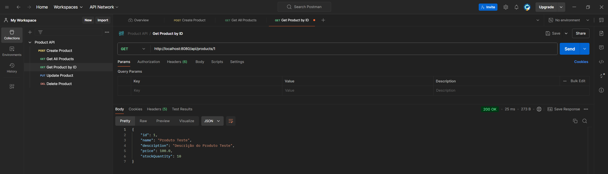
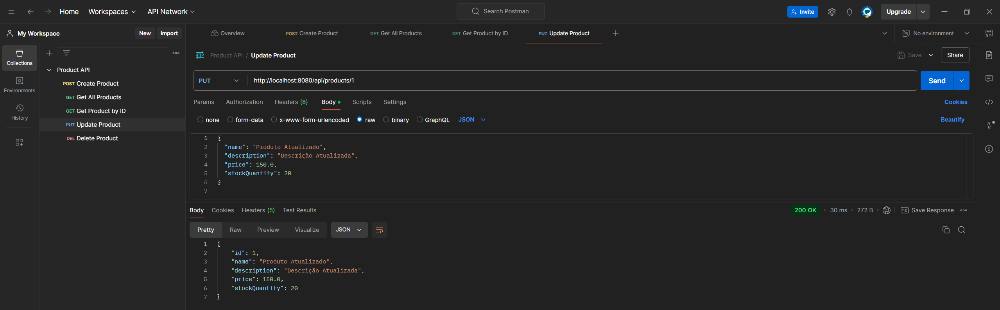
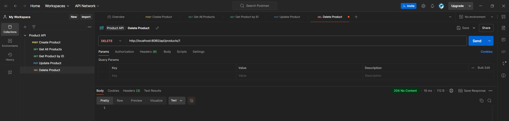
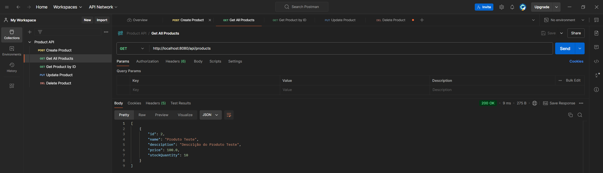

# Atividade 16 - Praticando Testes Unitários

## Descrição

Este projeto é uma API RESTful simples desenvolvida em Spring Boot com funcionalidades CRUD (Create, Read, Update, Delete) para gerenciar uma lista de produtos. A API se conecta a um banco de dados em memória (H2 Database) e inclui testes unitários para garantir a confiabilidade e a integridade das operações.

## Proposta

**Objetivo**: Desenvolver uma API REST simples em Spring Boot com funcionalidades CRUD (Create, Read, Update, Delete) e implementar testes unitários para garantir a confiabilidade e a integridade das operações.

**Descrição da Atividade**:
Crie uma API RESTful para gerenciar uma lista de produtos. Cada produto deverá ter os seguintes atributos:
- ID
- Nome
- Descrição
- Preço
- Quantidade em Estoque

A API deverá ter endpoints para as operações CRUD:
- **Create**: Adicionar um novo produto.
- **Read**: Recuperar a lista de produtos e buscar um produto específico por ID.
- **Update**: Atualizar as informações de um produto existente.
- **Delete**: Remover um produto do sistema.

**Requisitos Técnicos**:
- Utilize Spring Boot e as anotações do Spring (ex: @RestController, @Service, @Repository).
- A API deverá se conectar a um banco de dados em memória (ex: H2 Database) para persistir os dados durante a execução.
- Crie testes unitários para cada operação usando JUnit e Mockito, garantindo que todos os métodos sejam testados de forma isolada.
- Implemente boas práticas de arquitetura em camadas: controller, service e repository.
- A API deverá retornar respostas JSON.

**Critérios de Avaliação**:
- Funcionalidade: Todos os endpoints CRUD estão funcionando conforme esperado.
- Qualidade dos Testes: Os testes unitários cobrem todas as operações CRUD, com validações de sucesso e cenários de erro.
- Organização e Boas Práticas: O código segue uma estrutura organizada e é documentado.
## Funcionalidades

- **Create**: Adicionar um novo produto.
- **Read**: Recuperar a lista de produtos e buscar um produto específico por ID.
- **Update**: Atualizar as informações de um produto existente.
- **Delete**: Remover um produto do sistema.

## Tecnologias Utilizadas

- Java 17
- Spring Boot 3.3.5
- Spring Data JPA
- H2 Database
- JUnit e Mockito para testes unitários
- Postman desktop

## Como Executar o Projeto

### Pré-requisitos

- Java 17 instalado
- Maven instalado
- Postaman desktop

### Passo a Passo

1. **Clonar o Repositório**:
  ```bash
   git clone https://github.com/RafaelSanntos/atividade-16-testes-unitarios.git
  ```

2. **Acesse a pasta do projeto**:
  ```bash
   cd atividade-16-testes-unitarios
  ```

3. **Construir o Projeto**:
  ```bash
   mvn clean install
  ```
4. **Executar a Aplicação**:
  ```bash
   mvn spring-boot:run
  ```

5. **Acessar a API**:
   - Use a ferramenta Postman para testar a API

## Endpoints da API

### Criar Produto

- **URL**: /api/products
- **Método**: POST
- **Body**:
  {
    "name": "Produto Teste",
    "description": "Descrição do Produto Teste",
    "price": 100.0,
    "stockQuantity": 10
  }

### Obter Todos os Produtos

- **URL**: /api/products
- **Método**: GET

### Obter Produto por ID

- **URL**: /api/products/{id}
- **Método**: GET

### Atualizar Produto

- **URL**: /api/products/{id}
- **Método**: PUT
- **Body**:
  {
    "name": "Produto Atualizado",
    "description": "Descrição Atualizada",
    "price": 150.0,
    "stockQuantity": 20
  }

### Deletar Produto

- **URL**: /api/products/{id}
- **Método**: DELETE

## Testes Unitários

Os testes unitários estão localizados no pacote src/test/java/com/example/demo/service. Para executar os testes, use o comando:

```bash
mvn test
```

## Resultado dos testes

### Criar Produto
- Criei o produto com ID 1 e 2



### Obter Todos os Produtos



### Obter Produto por ID



### Atualizar Produto



### Deletar Produto



### Verificar quantidade de produtos após deletar 1 produto



## Contribuição

Sinta-se à vontade para contribuir com melhorias para este projeto. Para isso, siga os passos abaixo:

1. Faça um fork do projeto.
2. Crie uma nova branch (git checkout -b feature/nova-feature).
3. Faça commit das suas alterações (git commit -am 'Adiciona nova feature').
4. Faça push para a branch (git push origin feature/nova-feature).
5. Abra um Pull Request.

## Projeto desenvolvido para o curso Full Stack JavaScript - MaisPraTI - por Rafael Santos

```bash
  https://github.com/rafaelsanntos
```

## Licença

Este projeto está licenciado sob a Licença MIT - veja o arquivo LICENSE para mais detalhes.
